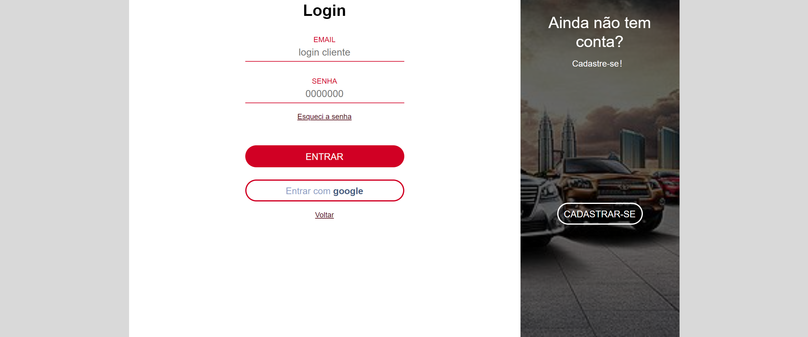

Projeto de uma concessionária de veículos feito com PHP e Javascript
<!DOCTYPE html>
<html lang="pt-br">
<head>
    <meta charset="UTF-8">
    <meta name="viewport" content="width=device-width, initial-scale=1.0">
</head>
<body>
    
    
    
    
    
    
    

</body>
</html>
